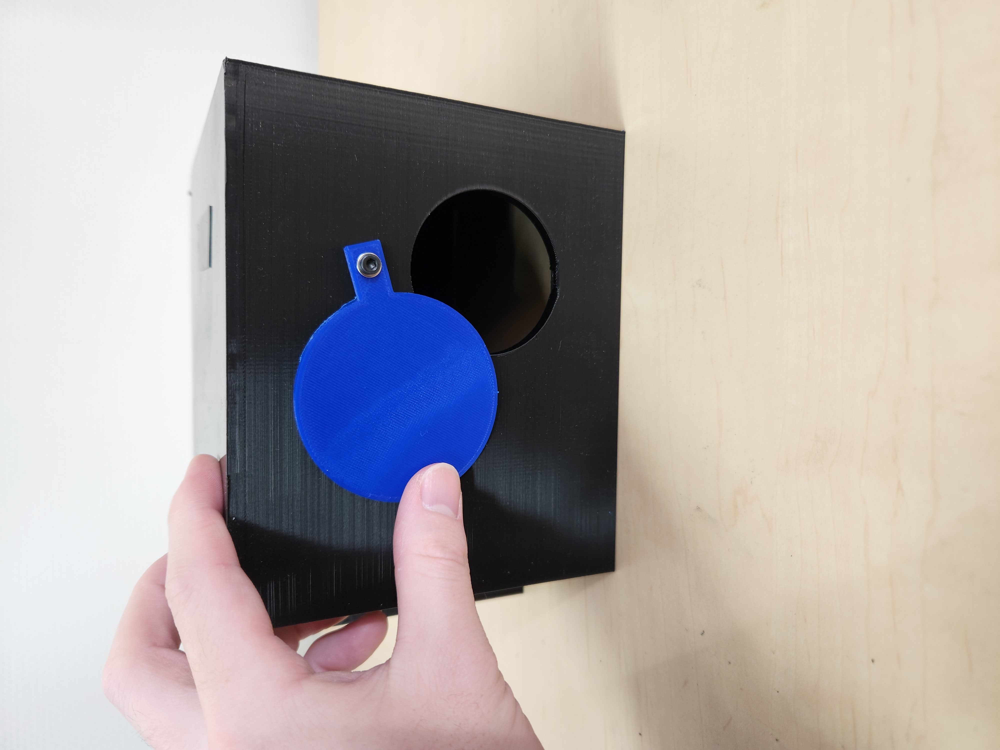
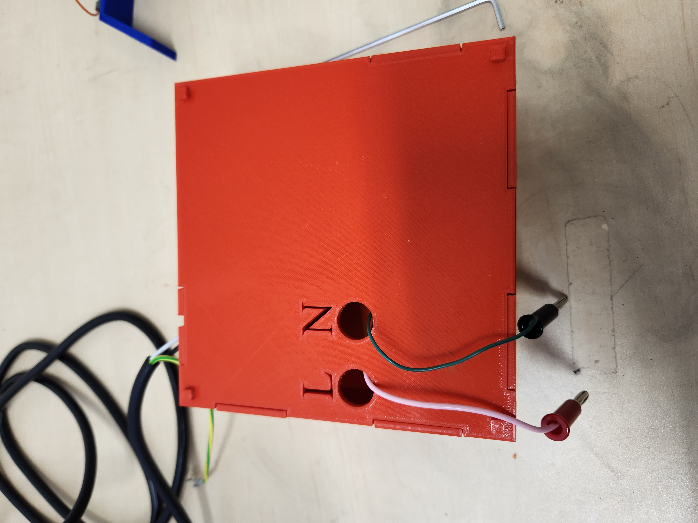
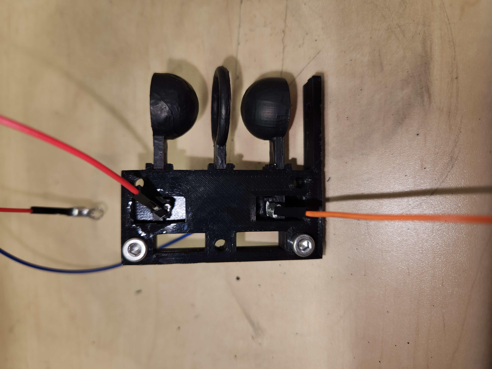
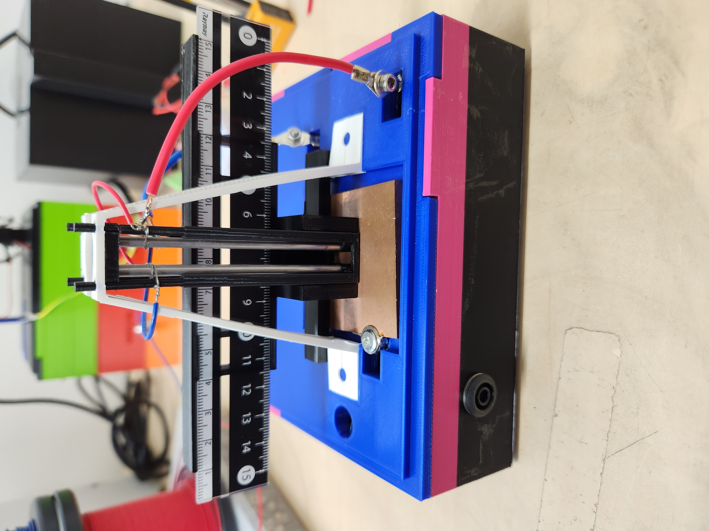

# Printable Paul Trap

This repository contains the 3D-printable parts and assembly documentation for a compact Paul trap designed for physics education. The system consists of a high-voltage power-supply module, a protective enclosure, and a choice of two electrode modules:

- a **ring-electrode module** with integrated illumination and a camera mount; or
- a **linear-electrode module** for quantitative observation and charge-to-mass-ratio measurements.

The repository is intended primarily as a build resource. For the complete photo-based instructions, see the [assembly manual](manual/manual.pdf). Videos of trapped particles are available in the [demonstration playlist](https://www.youtube.com/playlist?list=PLJxrDB4DxPX1ZcciUAjnfQ3G_OaAEvvxG).

> [!CAUTION]
> This apparatus uses **high voltage (up to several kilovolts)**. It is not a toy and must not be assembled or operated without appropriate laboratory supervision. High-voltage and mains-voltage wiring must be performed and inspected by a qualified person. Disconnect the power source, verify that the circuit is de-energized, and discharge the system before touching electrodes, terminals, wiring, or internal components. Follow all applicable electrical-safety rules at your institution.

## Contents

- [Before you start](#before-you-start)
- [Choose a trap configuration](#choose-a-trap-configuration)
- [Recommended build order](#recommended-build-order)
- [3D printing notes](#3d-printing-notes)
- [Parts and materials](#parts-and-materials)
- [Assembly overview](#assembly-overview)
- [Final inspection and commissioning](#final-inspection-and-commissioning)
- [Repository layout](#repository-layout)
- [Publication](#publication)
- [License](#license)

## Before you start

1. Read this README and the complete [assembly manual](manual/manual.pdf).
2. Choose either the ring-electrode or linear-electrode configuration.
3. Print all required STL files before purchasing or modifying hardware.
4. Dry-fit the printed parts and check all screw holes, slots, camera mounts, and cable routes.
5. Assemble and test the mechanical and low-voltage sections first.
6. Do not connect the high-voltage source until the entire assembly has been inspected.

The STL files are provided as finished meshes. Source CAD files and printer-specific slicing profiles are not included, so print tolerances may need to be adjusted for your printer.

## Choose a trap configuration

| Configuration | Main features | Important notes |
| --- | --- | --- |
| **Ring electrode** | Ring electrode with two endcaps, integrated LED illumination, internal camera mount, compact enclosure | The more integrated of the two designs. The documented electrode spacing was designed for operation up to 6 kV. |
| **Linear electrode** | Four-rod quadrupole, optional ruler for image calibration, separate bottom plate | This design is an experimental prototype and is less integrated. The documented setup used an external camera, an acrylic enclosure, and a laser pointer. The applied voltage was limited to approximately 2.1 kV. |

The quoted voltages describe the documented apparatus; they are **not** general operating recommendations. Safe limits depend on construction quality, insulation, electrode spacing, environment, and institutional procedures.

## Recommended build order

Build the modules in the following order:

1. **Shielding box** — protects trapped particles from air currents and reduces stray light.
2. **Power-supply enclosure** — houses the high-voltage transformer and switch.
3. **Electrode module** — assemble either the ring-electrode or linear-electrode version.
4. **Illumination and imaging** — install the LED or external light source and align the camera.
5. **Mechanical inspection** — check fasteners, clearances, cable strain relief, and exposed conductors.
6. **Electrical inspection and commissioning** — to be performed under qualified supervision.

## 3D printing notes

- Print the STL files at their original scale unless you intentionally redesign the mating parts.
- Use an opaque black material for `shielding_box.stl`, or paint the inside black, to reduce stray light.
- The M3 holes in the shielding box are modeled at approximately 3 mm and are not pre-tapped.
- Several press-fit parts are intentionally tight. Remove supports and clean edges before applying force.
- Check that conductive parts, screws, and wires cannot cut into insulation or contact the enclosure unexpectedly.
- Inspect printed parts for cracks, delamination, heat damage, and sharp edges before use.

## Parts and materials

The following lists summarize the hardware used in the documented build. Equivalent components may be used only after checking their electrical, mechanical, and safety ratings.

### Shielding box

Printed parts:

- [`shielding_box.stl`](stl_file/shielding_box/shielding_box.stl)
- [`window.stl`](stl_file/shielding_box/window.stl)

Additional hardware:

- M3 screws

### Power-supply module

Printed parts:

- [`power_supply_module_box.stl`](stl_file/power_supply_module/power_supply_module_box.stl)
- [`power_supply_module_box_lid.stl`](stl_file/power_supply_module/power_supply_module_box_lid.stl)

Components used in the documented build:

- toggle switch: S-21A, NKK Switches
- high-voltage transformer: UFO-6K-001-P100, Union Electric
- appropriately rated power cable
- two banana plugs
- suitable screws and nuts for securing the transformer

The documented transformer accepts 50/60 Hz AC at 0–100 V and has a nominal voltage ratio of 60. Treat both the input wiring and output wiring as hazardous.

### Ring-electrode module

Printed electrode parts:

- [`ring_electrode.stl`](stl_file/ring_type/ring_electrode.stl)
- [`endcap.stl`](stl_file/ring_type/endcap.stl)
- [`electrode_holder.stl`](stl_file/ring_type/electrode_holder.stl)

Printed enclosure and accessory parts:

- [`ring_trap_box.stl`](stl_file/ring_type/ring_trap_box.stl)
- [`ring_trap_box_lid.stl`](stl_file/ring_type/ring_trap_box_lid.stl)
- [`LED_holder.stl`](stl_file/ring_type/LED_holder.stl)
- [`camera_jig.stl`](stl_file/ring_type/camera_jig.stl)

Electrode hardware:

- conductive paint (SKU-0216, Bare Conductive, in the documented build)
- M3 low-profile screws, 4 mm
- jumper wires and crimp terminals
- M4 screws, 10 mm; hex-socket screws are recommended

Illumination and imaging:

- bright LED, preferably blue-toned
- breadboard, jumper wires, resistor, and 9 V battery
- toggle switch: RS PRO 448-0753
- battery strap: RS PRO 489-021
- USB camera: USB130W01MT-MF40-J in the documented build
- 1/4-inch camera screw

Main-body hardware:

- two banana sockets: Stäubli 23.3020-21
- two 10 MΩ resistors: TE Connectivity HB110MFZRE
- crimp terminals and insulated wiring

### Linear-electrode module

Printed parts:

- [`electrode_jig1.stl`](stl_file/linear_type/electrode_jig1.stl)
- [`electrode_jig2.stl`](stl_file/linear_type/electrode_jig2.stl)
- two copies of [`electrode_jig_stopper.stl`](stl_file/linear_type/electrode_jig_stopper.stl)
- [`linear_trap_box.stl`](stl_file/linear_type/linear_trap_box.stl)
- [`linear_trap_box_lid.stl`](stl_file/linear_type/linear_trap_box_lid.stl)
- [`ruler_jig.stl`](stl_file/linear_type/ruler_jig.stl)

Additional hardware:

- four metal rods, approximately 3 mm in diameter and 75 mm long
- insulated wire and crimp terminals
- conductive metal plate, approximately 55 × 55 × 3 mm
- three banana sockets: Stäubli 23.3020-21
- two 10 MΩ resistors: TE Connectivity HB110MFZRE
- ruler for image calibration, if required
- external camera and enclosure; the documented setup used a Logicool C920n camera and an acrylic box

## Assembly overview

This section provides the build sequence. Refer to the [assembly manual](manual/manual.pdf) and the photographs under [`img/`](img/) for detailed views.

### 1. Shielding box

1. Print the box and window.
2. Clean the mating surfaces and verify that the window opens and closes freely.
3. Attach the window using M3 hardware.
4. If the enclosure is not opaque, paint the inside black before installing the trap.



### 2. Power-supply enclosure

> [!WARNING]
> Do not perform mains-voltage or high-voltage wiring unless you are qualified to do so. The enclosure does not make an incorrectly wired circuit safe.

1. Print the enclosure and lid, then dry-fit the transformer, switch, cables, and banana connectors.
2. Have a qualified person complete and inspect the electrical wiring shown in the manual.
3. Secure the transformer so that it cannot move or strain the wiring.
4. Add strain relief and insulation appropriate for the cable and voltage ratings.
5. Close the enclosure before any energized test.



### 3A. Ring-electrode module

1. Apply conductive paint to the ring electrode and both endcaps. Allow it to dry completely; apply additional coats if coverage is poor.
2. Prepare wires with crimp terminals and attach them to the electrodes using the low-profile screws.
3. Mount the electrodes in `electrode_holder.stl`, keeping the orientation shown in the manual.
4. Assemble and test the LED circuit separately at low voltage.
5. Install the two banana sockets in the main enclosure.
6. Install one 10 MΩ series resistor between each high-voltage input and its electrode connection, following the documented wiring and institutional safety requirements.
7. Place the LED circuit inside the enclosure and route the LED and electrode leads through the lid.
8. Install the camera jig and camera.
9. Insert the electrode holder and LED holder into the lid, then connect the electrode leads to the resistor terminals.
10. Confirm that the ring and endcaps are aligned and that no exposed conductor can contact the enclosure or camera hardware.



### 3B. Linear-electrode module

1. Insert the four metal rods into `electrode_jig1.stl`.
2. Fit `electrode_jig2.stl` over the rods and secure the assembly.
3. Wire diagonally opposite rods together to form the two electrode pairs of the quadrupole.
4. Route the wires away from adjacent conductors and add insulation where discharge could occur.
5. Lock the electrode assembly into the enclosure using the two printed stoppers.
6. Prepare the bottom plate and provide a secure electrical connection to it.
7. Install the three banana sockets: two for the quadrupole supply and one for the bottom plate.
8. Install the two 10 MΩ series resistors on the high-voltage inputs.
9. Place the bottom plate in the lid, connect it, close the enclosure, and install the electrode assembly.
10. If required, install the ruler and ruler jig for image calibration.
11. Place the complete trap inside a suitable protective enclosure and align the external camera and light source.



## Final inspection and commissioning

Before applying power, verify all of the following:

- all printed parts are intact and securely fastened;
- the electrode geometry matches the manual;
- high-voltage conductors are insulated, mechanically secured, and separated appropriately;
- the 10 MΩ series resistors are installed correctly;
- no bare terminal is accessible during operation;
- cables have strain relief and cannot be pulled into the electrodes;
- the power-supply enclosure is closed;
- the camera and illumination system work before high voltage is enabled;
- a qualified person has inspected the complete electrical assembly;
- an emergency shutdown procedure is understood by everyone present.

Begin commissioning at the lowest practical input and increase it only under controlled laboratory procedures. Never adjust, reconnect, or reposition the apparatus while energized.

## Repository layout

```text
.
├── img/                  # Assembly and reference photographs
├── manual/
│   └── manual.pdf        # Complete photo-based assembly manual
├── stl_file/
│   ├── shielding_box/    # Protective enclosure
│   ├── power_supply_module/
│   ├── ring_type/        # Ring-electrode trap
│   └── linear_type/      # Linear-electrode trap
├── LICENSE
└── README.md
```

## Publication

The design and its use in charge-to-mass-ratio measurements are described in:

R. J. Saito, T. A. Tanaka, Y. Sakemi, M. Yagyu, and K. S. Tanaka, “Measurement of the charge-to-mass ratio of particles trapped by the Paul trap for education,” *Physics Education* **59** (2024) 025028. [https://doi.org/10.1088/1361-6552/ad27a8](https://doi.org/10.1088/1361-6552/ad27a8)

```bibtex
@article{Saito2024PaulTrap,
  author  = {Saito, R. J. and Tanaka, T. A. and Sakemi, Y. and Yagyu, M. and Tanaka, K. S.},
  title   = {Measurement of the charge-to-mass ratio of particles trapped by the Paul trap for education},
  journal = {Physics Education},
  volume  = {59},
  number  = {2},
  pages   = {025028},
  year    = {2024},
  doi     = {10.1088/1361-6552/ad27a8}
}
```

## License

This repository is distributed under the [MIT License](LICENSE).

The license covers the files in this repository. Commercial components, photographs, third-party product names, and referenced publications may be subject to their own terms.
